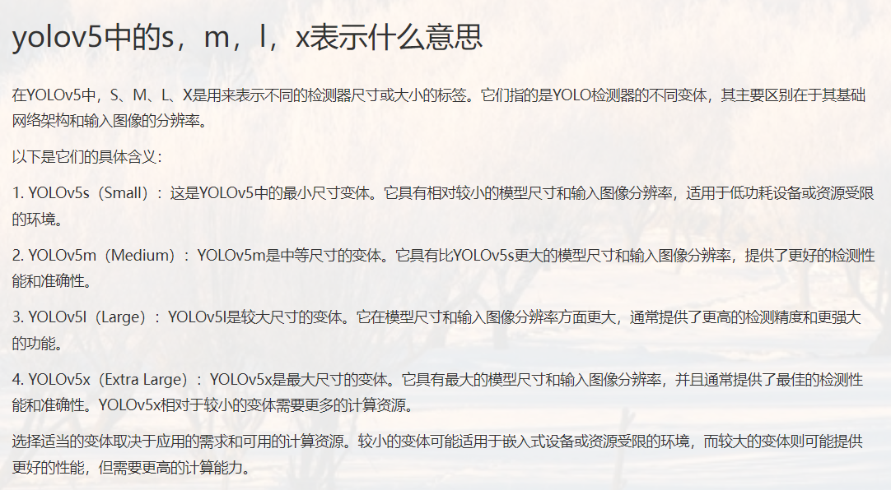

- [服务器使用指南-by时](#服务器使用指南-by时)
    - [linux主机远程管理软件下载安装](#linux主机远程管理软件下载安装)
    - [远程ssh登录服务器](#远程ssh登录服务器)
    - [服务器联网](#服务器联网)
    - [安装conda环境](#安装conda环境)
      - [安装miniconda](#安装miniconda)
      - [conda换源](#conda换源)
      - [pip换源](#pip换源)
    - [GPU调用、Pycharm连接等（以yolov5为例）](#gpu调用、pycharm连接等（以yolov5为例）)
      - [拉取源码](#拉取源码)
      - [安装cuda](#安装cuda)
      - [安装torch和torchvision](#安装torch和torchvision)
      - [安装其他python包](#安装其他python包)
      - [Pycharm远程调试服务器代码](#pycharm远程调试服务器代码)
      - [准备模型](#准备模型)
    - [Linux常用命令及技巧](#linux常用命令及技巧)
      - [通过会话在后台跑程序](#通过会话在后台跑程序)
      - [服务器使用梯子方便下载包、数据集、模型文件、克隆仓库等](#服务器使用梯子方便下载包、数据集、模型文件、克隆仓库等)

# 服务器使用指南-by时

### linux主机远程管理软件下载安装

下载链接：https://www.xshell.com/zh/free-for-home-school/


填写姓名邮件，选择两者，邮件会收到下载链接，下载安装即可。

**注：Xshell用于ssh连接服务器，Xftp用于与服务器文件进行互相传输，Xmanager用于连接校园网（非免费，需要使用破解补丁）。**

***

### 远程ssh登录服务器


打开安装好的xshell，在弹出的会话中新建，名称随意，主机填写申请到的IP地址。


此外，还需要设置代理才能连接到服务器。代理-浏览-添加-填写代理主机IP及端口。随后选择添加的代理服务器，点击连接即可。


首次登录会弹出提示输入用户名和密码，将申请到的用户名和密码填写即可，可以勾选记住用户名和密码，下次登录就无需再次输入了。这样就登录上服务器了。


##### 服务器联网

***

服务器需要使用xmanager打开校园网登陆界面联网：

在命令行输入firefox打开火狐浏览器，输入10.80.128.2进入校园网登录界面，输入一卡通号和密码登录即可。

测试网络状态

```shell
ping www.baidu.com
```


出现类似这样的说明已经网络连通了


**注：xmanager没有学生免费使用的优惠，需要自行破解。**

xmanager的破解补丁链接：https://gitcode.com/open-source-toolkit/e1a5a/?utm_source=tools_gitcode&index=top&type=card&&uuid_tt_dd=10_6637885510-1752204339569-876898&isLogin=1&from_id=142889247&from_link=896d219d7cfba93c6e8b0f390c158fe3

***

### 安装conda环境

#### 安装miniconda

Miniconda和Anaconda的区别：


由于我们每个项目需要不同的环境，并不需要anaconda自带的环境，故选择安装miniconda即可。


服务器为linux系统，且为64位操作系统，下载最新版`miniconda`

Miniconda官网：https://docs.conda.io/en/latest/miniconda.html

下载链接：https://repo.anaconda.com/miniconda/Miniconda3-latest-Linux-x86_64.sh

下载完成后利用xftp将安装包放在服务器自己的路径下。


也可在保证服务器联网时使用`wget`命令直接下载到服务器中：

```shell
wget https://repo.anaconda.com/miniconda/Miniconda3-latest-Linux-x86_64.sh
```


请保证下载到100%，否则安装程序无法正常运行。

赋予安装程序执行权限：

```shell
chmod +x Miniconda3-latest-Linux-x86_64.sh
```

运行安装程序：

```shell
./Miniconda3-latest-Linux-x86_64.sh
```

开头是许可协议啥的，回车即可，输入`yes`即可开始安装，后面路径、添加到环境变量（这里输入yes）默认回车即可。


安装完成后，关闭xshell并重新连接服务器后，发现用户名前出现base，说明已经正确安装了miniconda，并处于base环境下。


conda常见使用命令：

- `conda create -n env_name python=3.10`：创建一个新的conda环境。
- `conda env list`：列出所有conda环境。
- `conda activate env_name`：激活某个conda环境。
- `conda deactivate`：退出当前conda环境。
- `conda env remove -n  env_name --all`：删除某个conda环境。

#### conda换源

由于默认conda源链接为默认官方链接，使用conda装环境下载速度过慢

```shell
conda config --show
```


切换到清华镜像源

```shell
conda config --add channels https://mirrors.tuna.tsinghua.edu.cn/anaconda/pkgs/main/
conda config --add channels https://mirrors.tuna.tsinghua.edu.cn/anaconda/pkgs/free/
conda config --add channels https://mirrors.tuna.tsinghua.edu.cn/anaconda/cloud/conda-forge/
conda config --add channels https://mirrors.tuna.tsinghua.edu.cn/anaconda/cloud/msys2/
conda config --add channels https://mirrors.tuna.tsinghua.edu.cn/anaconda/cloud/bioconda/
conda config --add channels https://mirrors.tuna.tsinghua.edu.cn/anaconda/cloud/menpo/
conda config --add channels https://mirrors.tuna.tsinghua.edu.cn/anaconda/cloud/pytorch/
conda config --set show_channel_urls yes
```

即可更换成功


#### pip换源

大部分python包使用pip来安装，默认的pip源位于国外，安装python包比较慢，需要进行换源。

一键更换pip源为清华源

```shell
pip config set global.index-url https://pypi.tuna.tsinghua.edu.cn/simple
```

***

#### Pycharm远程调试服务器代码


右下角选择解释器---添加解释器---ssh解释器---新建ssh并测试连接成功---选择服务器自己目录下miniconda下的对应的python解释器---本地电脑的文件夹路径与服务器的项目文件夹进行对应---取消自动同步---检查是否配置正确---应用即可


连接到远程服务器之后，在pycharm中点击Tools-Deployment-Browse Remote Host即可查看和修改远程服务器内的文件。


**原理：当选择了远程解释器后，pycharm只是起到一个监视运行结果的作用。当在本地pycharm修改完代码之后，仍需要把修改后的代码上传到远程服务器，这样运行的才是最新代码。所以没必要把数据集和模型文件放在本地电脑，代码运行全是在远程服务器上的。**


#### 准备模型

从github上下载yolov5的v5.0的预训练模型：https://github.com/ultralytics/yolov5/releases

在v5.0下我们能看到很多版本的预训练模型，这是他们的区别：



这里我选择了yolov5s


下载后放在yolov5/weights文件夹下（可使用xftp直接从本地电脑拖到目标文件夹下）


有了预训练模型其实可以测试项目yolov5/data/images自带的图片了

修改detect.py文件，修改模型位置、device默认值设为1（1代表位置2的显卡）


修改完需要上传到远程服务器，这样运行的才是最新的代码：鼠标右击---上传到远程服务器---运行


可以看到运行成功，结果保存在如下位置：


xftp打开到此目录下，可以看到有两个已经预测完成的图片，右键打开可以看到预测的图片


### Linux常用命令及技巧


#### 通过会话在后台跑程序

通过xshell远程ssh连接服务器后，可以直接在命令行运行程序，然而当关闭`shell`窗口时，前台运行的程序或命令也会随之关闭。那么你之前所做的所有工作可能都会丢失，所做的工作可能都要重做一遍，这会浪费我们许多的时间，非常影响我们的工作。

`screen` 命令允许用户在一个窗口内使用多个终端会话，可以断开连接，也可以重新连接已断开连接的会话。每个会话都可以恢复连接，这样就算会话断开了，用户也不必担心数据丢失，这正好解决了我们的问题。

```shell
screen -S test # 创建一个叫test的会话
```

这样就会进入到全新的会话，只要服务器没有异常断电或者主动销毁会话这个会话就会一直存在。

当需要暂时离开会话，并保持会话里的程序不会中断，可使用

```
Ctrl+A+D
```

即可分离会话。

如需重新连接会话则使用

```shell
screen -r test # 重新连接test会话
```

如需销毁会话，则在会话中输入命令：

```shell
exit # 销毁test会话
```

注意：routes里的配置是为了可通过校园网直接访问改系统部署的服务，如：ssh、web、ftp、api等


