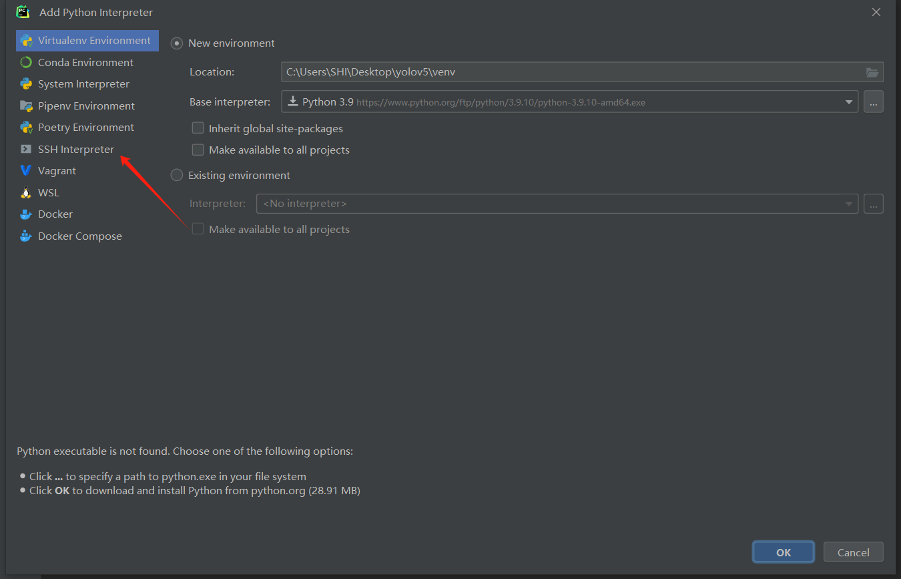

# 服务器使用指南-by时

***

### linux主机远程管理软件下载安装

下载链接：https://www.xshell.com/zh/free-for-home-school/


填写姓名邮件，选择两者，邮件会收到下载链接，下载安装即可。

**注：Xshell用于ssh连接服务器，Xftp用于与服务器文件进行互相传输。**

***

### 远程ssh登录服务器

#### 谢老师服务器篇

打开安装好的xshell，在弹出的会话中新建，名称随意，主机填写IP地址。


点击连接，首次登录会弹出提示输入用户名和密码，可以勾选记住用户名和密码，下次登录就无需再次输入了。这样就登录上服务器了。


#### 院长服务器篇

打开安装好的xshell，在弹出的会话中新建，名称随意，主机填写申请到的IP地址。


此外，还需要设置代理才能连接到服务器，具体原因可能学院为了增强安全性。代理-浏览-添加-按照微信群公告填写代理主机IP及端口。（用户名和密码可不填）。随后选择添加的代理服务器，点击连接即可。


首次登录会弹出提示输入用户名和密码，将申请到的用户名和密码填写即可，可以勾选记住用户名和密码，下次登录就无需再次输入了。这样就登录上服务器了。


##### 服务器联网

***

院长服务器只对接了njupt校园网，不属于校园卡电信或移动。所以请提前在南京邮电大学小程序一卡通网费进行充值（价格：0.2元/小时）。

在命令行输入：

```shell
curl -d "DDDDD=学号&upass=密码&0MKKey=%B5%C7%A1%A1%C2%BC&v6ip=" "192.168.168.168"
```

测试网络状态

```shell
ping www.baidu.com
```


出现类似这样的说明已经网络连通了

可写成一个shell脚本，方便使用

命令行输入：

```shell
echo 'curl -d "DDDDD=学号&upass=密码&0MKKey=%B5%C7%A1%A1%C2%BC&v6ip=" "192.168.168.168"' > login.sh
```

登陆时即可用：

```shell
bash login.sh
```

登录

同样，如果服务器登陆了自己的账号，使用完了想退出登录，可输入命令：

```shell
curl "192.168.168.168/F.htm"
```

即可退出登录，可以用ping命令进行验证

**注：可提前使用ping命令先测试，如果网络不通再去登录，节省网费。因为服务器网卡是共享的，只要有一个人连接了网络，所有人都可以使用网络。**

***

### 安装conda环境

#### 安装miniconda

Miniconda和Anaconda的区别：


由于我们每个项目需要不同的环境，并不需要anaconda自带的环境，故选择安装miniconda即可。


服务器为linux系统，且为64位操作系统，下载最新版`miniconda`

Miniconda官网：https://docs.conda.io/en/latest/miniconda.html

下载链接：https://repo.anaconda.com/miniconda/Miniconda3-latest-Linux-x86_64.sh

下载完成后利用xftp将安装包放在服务器自己的路径下。


也可在保证服务器联网时使用`wget`命令直接下载到服务器中：

```shell
wget https://repo.anaconda.com/miniconda/Miniconda3-latest-Linux-x86_64.sh
```


请保证下载到100%，否则安装程序无法正常运行。

赋予安装程序执行权限：

```shell
chmod +x Miniconda3-latest-Linux-x86_64.sh
```

运行安装程序：

```shell
./Miniconda3-latest-Linux-x86_64.sh
```

开头是许可协议啥的，回车即可，输入`yes`即可开始安装，后面路径、添加到环境变量（这里输入yes）默认回车即可。


安装完成后，关闭xshell并重新连接服务器后，发现用户名前出现base，说明已经正确安装了miniconda，并处于base环境下。


conda常见使用命令：

- `conda create -n env_name python=3.10`：创建一个新的conda环境。
- `conda env list`：列出所有conda环境。
- `conda activate env_name`：激活某个conda环境。
- `conda deactivate`：退出当前conda环境。
- `conda env remove -n  env_name --all`：删除某个conda环境。

#### conda换源

由于默认conda源链接为默认官方链接，使用conda装环境下载速度过慢

```shell
conda config --show
```


切换到清华镜像源

```shell
conda config --add channels https://mirrors.tuna.tsinghua.edu.cn/anaconda/pkgs/main/
conda config --add channels https://mirrors.tuna.tsinghua.edu.cn/anaconda/pkgs/free/
conda config --add channels https://mirrors.tuna.tsinghua.edu.cn/anaconda/cloud/conda-forge/
conda config --add channels https://mirrors.tuna.tsinghua.edu.cn/anaconda/cloud/msys2/
conda config --add channels https://mirrors.tuna.tsinghua.edu.cn/anaconda/cloud/bioconda/
conda config --add channels https://mirrors.tuna.tsinghua.edu.cn/anaconda/cloud/menpo/
conda config --add channels https://mirrors.tuna.tsinghua.edu.cn/anaconda/cloud/pytorch/
conda config --set show_channel_urls yes
```

即可更换成功


#### pip换源

大部分python包使用pip来安装，默认的pip源位于国外，安装python包比较慢，需要进行换源。

一键更换pip源为清华源

```shell
pip config set global.index-url https://pypi.tuna.tsinghua.edu.cn/simple
```

***

### 跑通Yolov5做迁移训练

#### 拉取源码

首先使用`conda`创建虚拟环境并激活环境：

```shell
conda create -n yolov5 python=3.8
conda activate yolov5
```

从github仓库拉取yolov5源代码：

```shell
git clone --branch v5.0 https://github.com/ultralytics/yolov5.git # 将yolov5官方项目克隆到服务器上，branch版本分支为5.0
cd yolov5
```

使用cat命令查看到yolov5所需的环境。

```shell
cat requirements.txt
```


需要使用到torch和torchvision这两个包的，且需要满足版本要求。由于torch和torchvision版本有对应关系，而且torch和cuda版本也有版本对应关系，而cuda版本取决于显卡和显卡驱动，所以在安装torch和torchvision包之前应先确认显卡及显卡驱动。安装好cuda之后再去安装torch和torchvision包。

#### 安装cuda

```shell
nvidia-smi # 查看显卡驱动支持的cuda版本
```


**注：显卡的算力也决定了cuda的版本，比如RTX3090的算力为8.6，就不支持cuda11.0及以下的版本，所以在安装cuda之前可以先调查以下服务器的显卡型号，以及支持的cuda版本**

可以看到当前服务器显卡支持最大cuda版本为12.2。所以我们可以安装版本低于12.2的cuda。安装cuda有多种方式：

##### 1、本地安装cuda

当你需要使用cuda来编译程序的话，则需要使用本地安装，否则建议在虚拟环境中安装。

非root本地安装cuda可以参考这篇文章：https://zhuanlan.zhihu.com/p/476313656?utm_id=0

##### 2、conda安装cuda

可使用conda直接安装cudatoolkit和cudnn(实现高性能GPU加速)

cuda和cudnn版本对应关系：https://developer.nvidia.com/rdp/cudnn-archive

```shell
conda install cudatoolkit=11.1
conda install cudnn=8.2.1
```

使用conda命令查看安装的conda包

```shell
conda list
```


#### 安装torch和torchvision

安装完cuda之后便可以安装torch和torchvision了

由于我们安装的cuda版本是11.1.1，所以torch应与cuda对应

torch与cuda版本对应关系：https://pytorch.org/get-started/previous-versions/

打开网页可用浏览器的ctrl+f网页搜索，输入cu111可找到多个版本的torch


按照requirements.txt要求，选择torch==1.10.0进行安装

```shell
pip install torch==1.10.0+cu111 torchvision==0.11.0+cu111 -f https://download.pytorch.org/whl/torch_stable.html
```

由于默认的pytorch源也在国外，下载速度会很慢甚至连接不上，可替换成阿里云的源

```shell
pip install torch==1.10.0+cu111 torchvision==0.11.0+cu111 -f https://mirrors.aliyun.com/pytorch-wheels/cu111/
```

耐心等待安装完成即可。

#### 安装其他python包

安装完成了torch和torchvision这两个最重要的包之后，其他包即可直接使用

```shell
pip install -r requirements.txt
```

进行安装了，这样就完成了所有的yolov5所需要的包


#### Pycharm远程调试服务器代码

Pycharm需2022年版及以上，附一个Pycharm安装教程：https://mp.weixin.qq.com/mp/appmsgalbum?__biz=MzA4MjU4MTg2Ng==&action=getalbum&album_id=3421643864929239051&scene=21#wechat_redirect

在自己电脑新建一个文件夹（文件夹名随意）


使用pycharm打开，并删除示例main.py文件

右下角选择解释器---添加解释器---ssh解释器---新建ssh并测试连接成功---选择服务器自己目录下miniconda下的对应的python解释器---本地电脑的文件夹路径与服务器的项目文件夹进行对应---取消自动同步---检查是否配置正确---应用即可---鼠标右击左侧项目文件夹---从远程下载代码到本地电脑---完成代码的同步





**原理：当选择了远程解释器后，即使在本地pycharm点击了运行了代码本质也是在远程运行的，pycharm只是起到一个监视运行结果的作用，debug也是给远程运行时的代码加了断点。当在本地pycharm修改完代码之后，仍需要把修改后的代码上传到远程服务器，这样运行的才是最新代码。所以没必要把数据集和模型文件放在本地电脑，代码运行全是在远程服务器上的。**

**注意：仅当从服务器文件下载代码时，项目文件夹下不要放数据集或模型等文件，会导致下载时间过长并占用本地电脑的内存，上传代码到远程服务器是无所谓的。**

#### 准备模型

从github上下载yolov5的v5.0的预训练模型：https://github.com/ultralytics/yolov5/releases

在v5.0下我们能看到很多版本的预训练模型，这是他们的区别：


这里我选择了yolov5s


下载后放在yolov5/weights文件夹下（可使用xftp直接从本地电脑拖到目标文件夹下）


有了预训练模型其实可以测试项目yolov5/data/images自带的图片了

修改detect.py文件，修改模型位置、device默认值设为1（1代表位置2的显卡）


修改完需要上传到远程服务器，这样运行的才是最新的代码：鼠标右击---上传到远程服务器---运行


可以看到运行成功，结果保存在如下位置：


xftp打开到此目录下，可以看到有两个已经预测完成的图片，右键打开可以看到预测的图片


### Linux常用命令及技巧

#### 环境变量

在


#### 通过会话在后台跑程序

通过xshell远程ssh连接服务器后，可以直接在命令行运行程序，然而当关闭`shell`窗口时，前台运行的程序或命令也会随之关闭。那么你之前所做的所有工作可能都会丢失，所做的工作可能都要重做一遍，这会浪费我们许多的时间，非常影响我们的工作。

`screen` 命令允许用户在一个窗口内使用多个终端会话，可以断开连接，也可以重新连接已断开连接的会话。每个会话都可以恢复连接，这样就算会话断开了，用户也不必担心数据丢失，这正好解决了我们的问题。

```shell
screen -S test # 创建一个叫test的会话
```

这样就会进入到全新的会话，只要服务器没有异常断电或者主动销毁会话这个会话就会一直存在。

当需要暂时离开会话，并保持会话里的程序不会中断，可使用

```
Ctrl+A+D
```

即可分离会话。

如需重新连接会话则使用

```shell
screen -r test # 重新连接test会话
```

如需销毁会话，则在会话中输入命令：

```shell
exit # 销毁test会话
```

